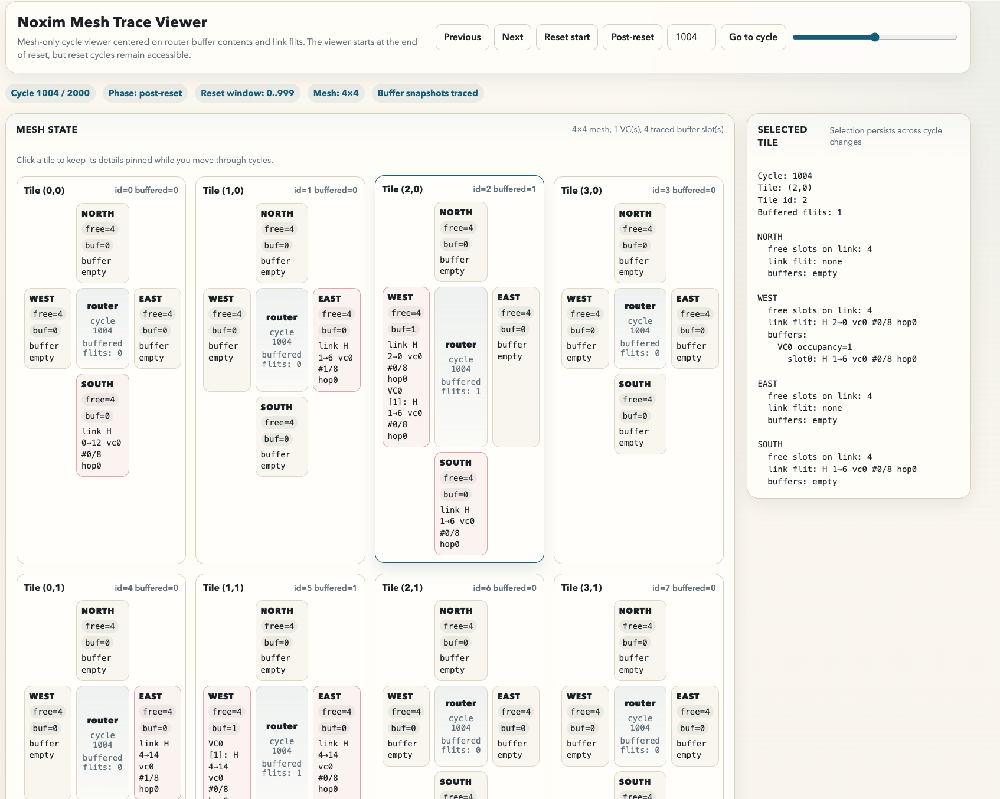

Noxim - the NoC Simulator
=========================

Welcome to Noxim, the Network-on-Chip Simulator developed at the University of Catania (Italy).
The Noxim simulator is developed using SystemC, a system description language based on C++, and
it can be downloaded under GPL license terms.

**If you use Noxim in your research, we would appreciate the following citation in any publications to which it has contributed:**

V. Catania, A. Mineo, S. Monteleone, M. Palesi and D. Patti, "Improving the energy efficiency of wireless Network on Chip architectures through online selective buffers and receivers shutdown," 2016 13th IEEE Annual Consumer Communications & Networking Conference (CCNC), Las Vegas, NV, 2016, pp. 668-673, doi: 10.1109/CCNC.2016.7444860.
[Scopus reference](https://www.scopus.com/record/display.uri?eid=2-s2.0-84966659566&origin=resultslist&sort=plf-f&src=s&sid=b531296d946a78b05f463c35c681a44c&sot=autdocs&sdt=autdocs&sl=18&s=AU-ID%2835610853000%29&relpos=14&citeCnt=6&searchTerm=)

V. Catania, A. Mineo, S. Monteleone, M. Palesi and D. Patti, "Energy efficient transceiver in wireless Network on Chip architectures," 2016 Design, Automation & Test in Europe Conference & Exhibition (DATE), Dresden, 2016, pp. 1321-1326.
[Scopus reference](https://www.scopus.com/record/display.uri?eid=2-s2.0-84973661681&origin=resultslist&sort=plf-f&src=s&sid=4bd3ffce04cc0093a84655249383aefa&sot=autdocs&sdt=autdocs&sl=18&s=AU-ID%2835610853000%29&relpos=11&citeCnt=11&searchTerm=)

Registration
------------
To receive information about new Noxim features, updates and events, please register here:
[Registration Form](https://docs.google.com/forms/d/e/1FAIpQLSfJnYQZwxC4gr4jUc-nuwuGp0MDBA-0N_TVf8hqV1DIa325Dg/viewform?c=0&w=1)

What's New ? 
------------
**[22nd April 2026]**

  * Added a deterministic regression test suite with pinned YAML configurations and golden outputs
  * Added `./regression.sh` for reproducible simulator verification across mesh and delta topologies
  * Added the [Noxim User Guide in Markdown](doc/Noxim_User_Guide.md) and [PDF](doc/Noxim_User_Guide.pdf)
  * Added runtime logging, optional text/CSV/JSON stats export, and scoped VCD tracing for easier debugging
  * Added `./visualNoxim` and `other/noxim_trace_viewer.py` for a cycle-by-cycle mesh visualizer with router-buffer and link-flit inspection
  * Happy birthday to Noxim co-author 0xff!

**[March 2018]**

  * Support for virtual channels for improved traffic management
  * Support for multiple radio-frequency channels for each Radio-Hub
  * New yaml examples (please update yours, since format is slightly different)
  
**[April 2017]** [Noxim tutorial slides](doc/noxim_tutorial.pdf) from lecture given at "Advanced Computer Architectures" (ELEC3219 - University of Southampton)

**[June 2015]** Massively improved version of Noxim. Major changes include:

  * Wireless transmission support
  * Hub connections for eterogeneous topologies
  * YAML configuration file for all features/parameters
  * Totally rewritten power model to support fine-grained estimation
  * Modular plugin-like addition of Routing/Selection strategies
  * Optional accurate logs for deep debugging (see DEBUG in Makefile)

Installation & Quick Start
-----------

If you are working on Ubuntu, you can install noxim and all the dependencies with the following command:
(**BE sure of copying the entire line, i.e., ending with "ubuntu.sh**)

    bash <(wget -qO- --no-check-certificate https://raw.githubusercontent.com/davidepatti/noxim/master/other/setup/ubuntu.sh)

Similarly for macOS:

    /bin/zsh -c "$(curl -fsSL https://raw.githubusercontent.com/davidepatti/noxim/master/other/setup/macos.zsh)"

As an alternative to the full automatic setup scripts above, you can just clone the sources:

    git clone https://github.com/davidepatti/noxim.git
    cd noxim

and then build from the repository root with:

    ./build.sh

This fixes the local dependencies under `bin/libs` and compiles `bin/noxim`.

For deterministic regression checks from the repository root, run:

    ./regression.sh

This rebuilds the simulator, runs the curated regression suite under
`other/regression/`, and compares the normalized simulator summaries with the
committed golden outputs. To refresh those golden outputs after intentionally
changing simulator behavior, use:

    ./regression.sh --update

For post-simulation inspection of mesh buffers and in-flight flits cycle by
cycle, run:

    ./visualNoxim -sim 40 -warmup 0 -seed 0 -pir 0.3 poisson

This produces a self-contained HTML viewer under `other/visualizer-output/`.
The wrapper uses scoped VCD tracing internally and has no dependency beyond
Python 3 and a browser. `visualNoxim` currently supports only `MESH`
topologies and checks that before running. If you already have a VCD trace,
you can convert it directly with:

    python3 other/noxim_trace_viewer.py --vcd path/to/trace.vcd --output path/to/trace.html --config config_examples/default_config.yaml

If you already cloned the repository and want to populate the local dependencies expected by
`bin/Makefile`, run:

    ./other/setup/fix-dependencies.sh

This installs SystemC into `bin/libs/systemc-2.3.1` and yaml-cpp into `bin/libs/yaml-cpp`.
`./other/setup/systemc.sh` is kept as a compatibility alias to the same flow.

Noxim has a command line interface for defining several parameters of a NoC. In particular the
user can customize the network size, buffer size, packet size distribution, routing algorithm,
selection strategy, packet injection rate, traffic time distribution, traffic pattern, hot-spot
traffic distribution.

The simulator allows NoC evaluation in terms of throughput, delay and power consumption. This
information is delivered to the user both in terms of average and per-communication results.

In detail, the user is allowed to collect different evaluation metrics including the total number
of received packets/flits, global average throughput, max/min global delay, total energy consumption,
per-communications delay/throughput/energy etc.

The Noxim simulator is shipped along with Noxim Explorer, a tool useful during the design space
exploration phase. Infact, Noxim Explorer executes many simulations using Noxim in order to explore
the design space, and modifying the configuration parameters for each simulation. Noxim Explorer will
create new configuration parameters for you, or complete the exploration according to the information
read from a script (known as exploration script or space file).
